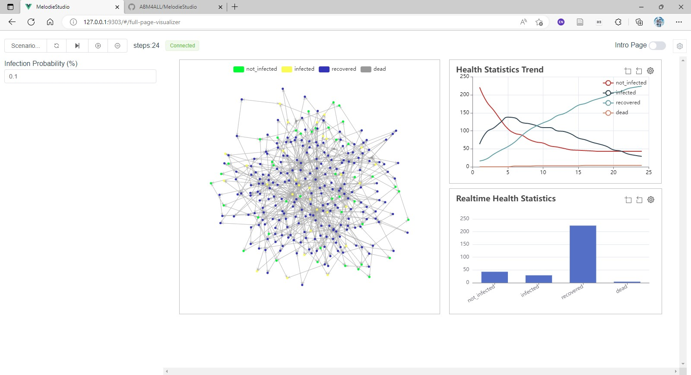
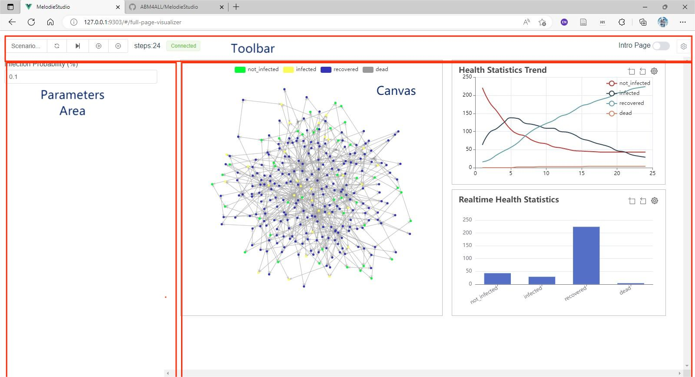

# Melodie Studio
The Frontend of Melodie, mainly implemented Visualizer page



The visualizer page can be divided into three parts: 

- Toolbar
    - Toolbar has several components controlling the simulation, saving and loading custom parameter set.
- Parameters Area
    - Listing parameters that affect the model.
    - Customizable in the custom subclass of `Melodie.Visualizer`.
- Canvas
    - Web-based visualization component for `Grid` and `Network`
    - Web-based chart including Line chart, Bar chart.
    - Customize visualization component and graph to show in the custom subclass of `Melodie.Visualizer`.
    <!--
        - Layout of visualization components and charts, together with chart styles, can be  configured by webpage, not coding. [Unstable]
    -->


## User Installation
### PIP installation
```sh
pip install MelodieStudio
```
### Run MelodieStudio
```sh
python -m MelodieStudio
```
If you are running a visualizer, please start the MelodieStudio in the root path of your ABM project.

## Developer Installation
### Project setup
```
npm install
```

### Compiles and hot-reloads for development
```
npm run serve
```

### Compiles and minifies for production
```
npm run build
```

### Dist wheel with building webpage:
```sh
python build_web.py # build webpage
python setup.py bdist_wheel # build wheel, and include the webpage.
```


## Technical Introduction

This project is based on Vue, Element-Plus and Echarts. Besides, the structure of project is based on [Vue-Onepiece-Admin](https://github.com/Mstian/Vue-Onepiece-Admin).


