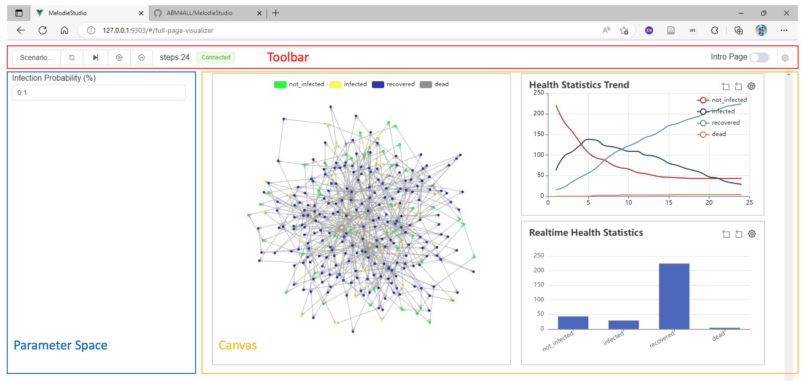

# MelodieStudio

## Introduction 

`MelodieStudio` is a package developed in parallel with `Melodie`, 
which interacts with the `Melodie.Visualizer` module and visualizes the simulation results in the browser.



As shown, the visualizer page includes three parts: 

- Toolbar
    - Including several components controlling the simulation, saving and loading custom parameter set.
- Parameter Space
    - Listing parameters that affect the model.
    - Customizable in the model-specific `visualizer.py` file.
- Canvas
    - Web-based visualization components for `Grid` and `Network`.
    - Web-based charts, including line chart, bar chart, etc.
    - Customizable in the model-specific `visualizer.py` file.
    <!--
        - Layout of visualization components and charts, together with chart styles, can be configured by webpage, not coding. [Unstable]
    -->

You can find two examples - [CovidGridContagionVisual](https://github.com/ABM4ALL/CovidGridContagionVisual) and 
[CovidNetworkContagionVisual](https://github.com/ABM4ALL/CovidNetworkContagionVisual) - 
using the `MelodieStudio` package, and they are explained in this 
[document](https://abm4all.github.io/Melodie/html/gallery/covid_contagion_visual.html).


## User Installation
### PIP installation
```sh
pip install MelodieStudio
```
### Run MelodieStudio
```sh
python -m MelodieStudio
```
If you are running a visualizer, please start the MelodieStudio in the root path of your ABM project.

## Developer Installation
### Project setup
```
npm install
```

### Compiles and hot-reloads for development
```
npm run serve
```

### Compiles and minifies for production
```
npm run build
```

### Dist wheel with building webpage:
```sh
python build_web.py # build webpage
python setup.py bdist_wheel # build wheel, and include the webpage.
```


## Technical Introduction

This project is based on Vue, Element-Plus and Echarts. Besides, the structure of project is based on [Vue-Onepiece-Admin](https://github.com/Mstian/Vue-Onepiece-Admin).


